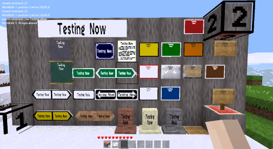

Write Sign
==============
This is an extension mod of [WorldEdit](https://github.com/Uberi/Minetest-WorldEdit) for [Minetest](https://minetest.net/), so you need WorldEdit mod to use this mod.

This mod adds new WorldEdit command that enables writing to supported signs.

For more information, see the [forum topic](https://forum.minetest.net/viewtopic.php?f=9&t=20712) at the Minetest forums.

Installing
----------

If you are using Windows, consider installing this mod using [MODSTER](https://forum.minetest.net/viewtopic.php?id=6497), a super simple mod installer that will take care of everything for you. If you are using MODSTER, skip directly to step 6 in the instructions below.

There is a nice installation guide over at the [Minetest Wiki](http://wiki.minetest.com/wiki/Installing_mods). Here is a short summary:

1. Download the mod from the [official releases page](https://github.com/MuhdNurHidayat/write_sign/releases). The download links are labelled "Source Code". If you are using Windows, you will probably want to download the ZIP version.
2. You should have a file named `SOMETHING.zip` or `SOMETHING.tar.gz`.
3. Extract this file using your archiver of choice. If you are using Windows, open the ZIP file and move the folder inside to a safe place outside of the ZIP file.
4. Make sure that you now have a folder with a file named README.md inside it. If you just have another folder inside this folder, use this nested folder instead.
5. Move this folder into the `MINETEST_FOLDER/mods` folder, where `MINETEST_FOLDER` is the folder Minetest is located in.
6. Open Minetest to a world selection screen.
7. Select a world you want to use this extension mod in by left clicking on it once, and press the **Configure** button.
8. You should have a mod selection screen. Select the one named something like `write_sign` by left clicking once and check the **enable** checkbox.
9. Press the **Save** button. You can now use this extension mod in that world. Repeat steps 7 to 9 to enable it for other worlds too.

If you are having trouble, try asking for help by opening [GitHub issue](https://github.com/MuhdNurHidayat/write_sign/issues) (faster but may not always have helpers online) or ask on the [forum topic](https://forum.minetest.net/viewtopic.php?f=9&t=20712) (slower but more likely to get help).

Usage
-----
Write Sign mod is only used to write text into signs using commands.

This mod could be used in two situations:
- When you want to set multiple signs with the same text.
- When the sign formspec could not accept certain characters due to Minetest formspec limitation but the characters could be written in chat.

Compatibility
-------------
This mod is tested and therefore supported Minetest version 0.4.17.1, however it might still work for older Minetest versions as long as it's not below 0.4.8, and might work on newer Minetest versions. I don't provide support for other Minetest versions.

This mod is usable with signs from default, signs_lib, and display_lib (from display_modpack).

Authors
-------
This mod is written by muhdnurhidayat based on and depends on WorldEdit, check out WorldEdit's contributor list on [their repository](https://github.com/Uberi/Minetest-WorldEdit) for more information.

License
-------
Original WorldEdit mod - Copyright 2013 sfan5, Anthony Zhang (Uberi/Temperest), and Brett O'Donnell (cornernote).

Modifications - Copyright 2018 Muhammad Nur Hidayat (MuhdNurHidayat).

This mod is an extension of and contains modified codes from WorldEdit and so it is licensed under the [GNU Affero General Public License](http://www.gnu.org/licenses/agpl-3.0.html) just like the original mod.

Basically, this means everyone is free to use, modify, and distribute the files, as long as these modifications are also licensed the same way.
Most importantly, the Affero variant of the GPL requires you to publish your modifications in source form, even if the mod is run only on the server, and not distributed.

